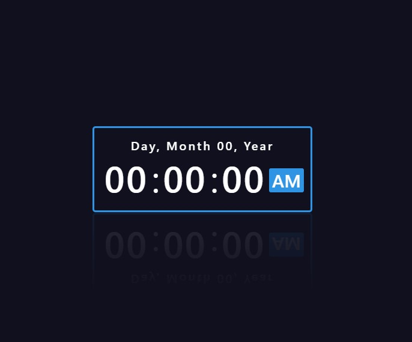

## DIGITAL CLOCK WITH HTML, CSS, JS  

  
El proyecto inicia con la Estructura y estilos base del reloj.  
Tienes que aplicar funcionalidad con Javascript y hacer que el reloj funcione como es debido.  

__TAREA:__

- Tomar hora y fecha de tu computadora
- Guardarlo en variables
- Mostrar en consola
- Mostrar en pantalla, remplazando los valores del reloj de forma automatica

